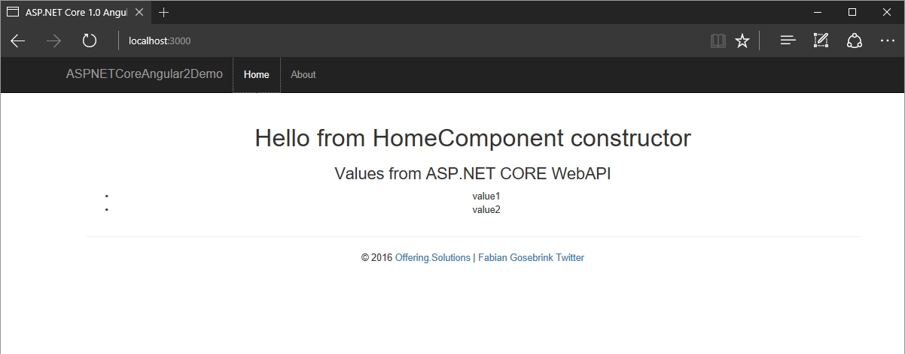

# Angular 2 ASP.NET CORE WebAPI Starter Template

This is a starter template for developing Angular2 with ASP.NET Core WebAPI Applications.

This template is done with npm. Its an Angular2 application with an http-service getting values from an ASP.NET CORE WebAPI.

## Blogpost

[Angular 2 and ASP.NET Core Starter](http://offering.solutions/articles/asp-net/angular-2-and-asp-net-core-starter/)

## Start

Start by typing

`npm install`

at the level of the "package.json" file

### Option 1

Now you can just press "play" inside Visual Studio to get started.

If you change the *.ts-files you need to run the `tsc` command manually.

### Option 2

`npm start` will run the gulp task for you, starting the lite-server, the dotnet server and the tsc-watcher.

See this nice link which the Angular team did by working with Visual Studio and Angular 2 [Visual Studio 2015 QuickStart
](https://angular.io/docs/ts/latest/cookbook/visual-studio-2015.html)

